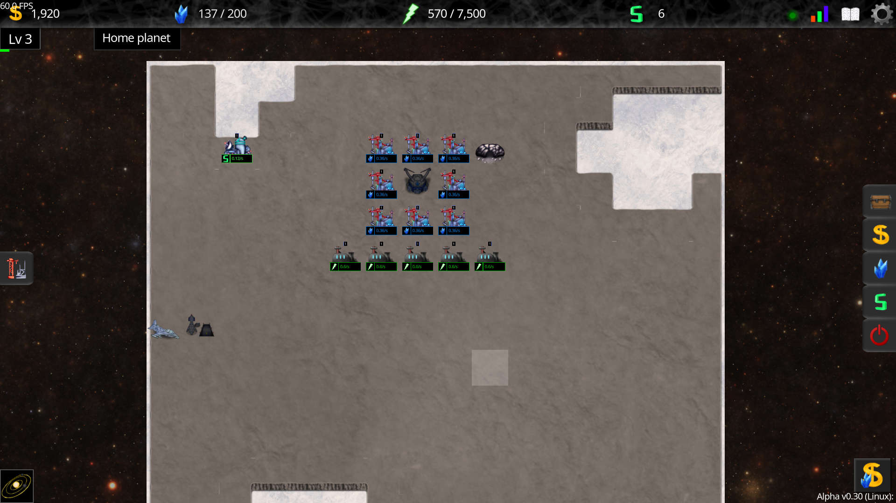

<h1 align="center">Helixteus 3</h1>

Helixteus 3 is a 2D space exploration game with incremental mechanics.
You start on a planet on which you can construct buildings to produce resources. Eventually you will acquire the means necessary to explore other procedurally generated planets, systems, galaxies, and eventually entire universes. They are not undefended however: primitive alien lifeforms exist in every corner of the universe and will not appreciate you expanding into their land.

[Play the game on itch.io](https://apple0726.itch.io/helixteus-3)

[Wishlist the game on Steam](https://store.steampowered.com/app/1642730/Helixteus_3/)

## Community
All active discussion is happening on our [Discord server](https://discord.com/invite/gDHcDA3). Come and say hi!

## Quick start for contributors
- Clone this Git repository.
- Download the [Godot game engine](https://godotengine.org/download).
- Open Godot, select `Import` from the projects list.
- Navigate to the location that you cloned the project, and import the `project.godot` file.

Having problems with importing Helixteus 3 into Godot? Feel free to ask for help in an [issue](https://github.com/Apple0726/helixteus-3/issues), or the `#development` channel of our [Discord server](https://discord.com/invite/gDHcDA3).

## Contributing

This project is community-driven, which means that anyone is able to help with the development of it. Here are some ways that you can contribute:

- Localization
- Concept art
- Music and sound effects
- Code
- Bug reports

### Localization
Want to add your language to the game, or improve existing translations? Localization is managed through [this spreadsheet](https://docs.google.com/spreadsheets/d/1-7KJ8WkyXwVS9X2XTegfZ0Sxl3_Dpvcu7ixid8FgKbw/edit?usp=sharing), so feel free to edit it if you have any changes that you want to make.

### Concept art
The game's graphical assets are found in `/Graphics`. An artist paid out of pocket draws most of them, however if you have a better idea of how something should look like, or have an idea for a new building, item etc., feel free to draw concept art and share it in the Discord server.

### Audio
Are you a music producer, or sound designer? All of the game's music is stored in `/Audio`, while the sound effects are in `/Audio/SFX`.
**Note:** Music should be in .ogg format, and SFX should be in .wav format.

### Development
Helixteus 3 is built using the [Godot game engine](https://godotengine.org/download). The biggest benefit of this is that it allows for the game to be easily cross-platform and portable.
Refer to the **Quick start for contributors** section above for information on how to import the game into the game engine to test your code.

**Code**

All of the game logic is written in [GDScript](https://docs.godotengine.org/en/stable/tutorials/scripting/gdscript/index.html), which is very easy to learn (inspired by Python). You will find all of this code in `/Scripts`.
Refactoring the code and fixing bugs is a great way to start with contributing code. If you are familiar with GDScript, bigger changes like improving algorithms and new features are welcome, however discussing such changes on GitHub or Discord is advised before working on them.

**Shaders**

This game also uses shaders to add visual effects. Godot uses a [custom shader language](https://docs.godotengine.org/en/stable/tutorials/shaders/shader_reference/shading_language.html), though it is very similar to GLSL. All of these shaders are in the `/Shaders` directory. If you are a GLSL wizard, then feel free to improve any existing shaders, or add new ones!

### Bug reports
Found something that should probably not be happening? Please make a detailed [issue](https://github.com/Apple0726/helixteus-3/issues) with logs if possible, and information on how to reproduce the unintended behavior. You may also make a report in the `#bug-reports` channel of our [Discord server](https://discord.com/invite/gDHcDA3).

## Support
All contributions and kind words are very appreciated! This game will always be available for free on itch.io (only Steam version is paid, which will include higher quality audio and graphics). If you want to financially support the development, you can "buy" the game on itch.io with an amount you decide.